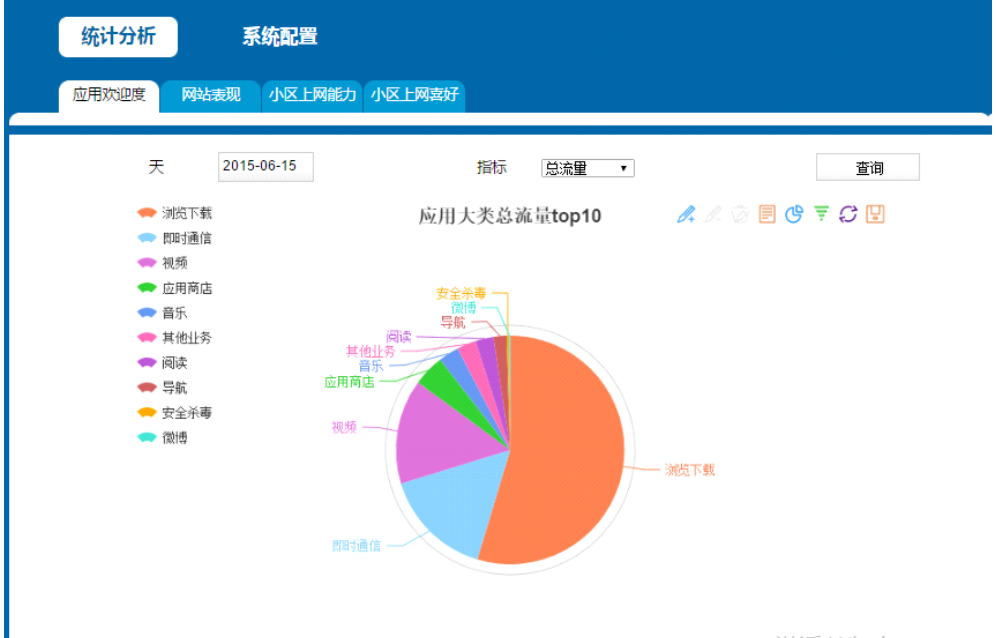
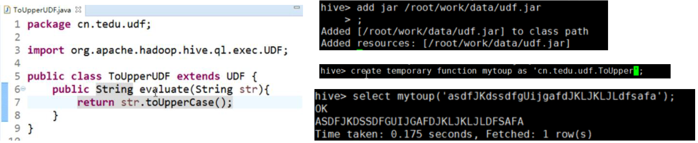

# Hive

## 1 什么是Hive

hive 是基于 Hadoop 的一个数据仓库工具，可以将结构化的数据文件映射为一张数据库表，并提供完整的 sql 查询功能，可以将 sql 语句转换为MapReduce 任务进行运行。

其优点是学习成本低，可以通过类 SQL 语句快速实现简单的 MapReduce 统计，不必开发专门的 MapReduce 应用，十分适合数据仓库的统计分析，但是 Hive 不支持实时查询。    

hive是OLAP的数据仓库：

**数据库属于OLTP系统。**（Online Transaction Processing）联机事务处理系统。涵盖了企业大部分的日常操作，如购物、库存、制造、银行、工资、注册、记账等。比如Mysql，oracle等关系型数据库。

**数据仓库属于****OLAP****系统。**（Online Analytical Processing）联机分析处理系统。Hive，Hbase等

## 2 Hive的使用

### 2.1 基础操作

#### 2.1.1 Hive安装

1.安装JDK

2.安装Hadoop

3.配置JDK和Hadoop的环境变量

4.下载Hive安装包

5.解压安装hive

6.启动Hadoop的HDFS和Yarn

7.启动Hive

进入到bin目录，指定：sh hive （或者执行：./hive）

#### 2.1.2 Hive创建库表

创建数据库，表面是SQL，底层还是HADOOP

```
create database park01;
```

创建表

```
create table stu(id int, name string);
```

会发现其实数据库和表文件都是文件夹！由内容的表就有文件


插入数据

```
insert into stu values(1,”tom”);
```

然后查询

```
select * from stu;
```

#### 2.1.3 复制表

复制表结构

```
create table stu2 like stu1;
```

复制表数据

```
insert overwrite table stu2 select * from stu1 where salary>5000;
```

#### 2.1.4 Hive读取文件数据

创建文件3.txt，内容如下：

```
2 rose 
3 jim
4 jary
```

然后执行，这里没有指定列分隔符，查出来都会是NULL

```
load data local inpath ‘/home/3.txt’ into table stu;
```

删表重建

```
create table stu(id int, name string) row format delimited fields terminated by ‘ ‘ ;
load data local inpath ‘/home/3.txt’ into table stu;
```

#### 2.1.5 排序操作

排序操作，底层还是调用的MR，Mapper输出key是对象，用MR作可以，但是Hive日常操作更快

```
select * from stu1 order by salary;
```

#### 2.1.6 join操作

join就是inner join，还有left join 左连接，right join 右连接，full outer join 全连接！

```
select * from product_t inner join order_t on product_t.pid = order_t.pid
```


### 2.2  内部表和外部表

**内部表：**先创建一张Hive表，然后向表里插入数据；**特点：先有表，再有数据**；之前创建的表都是内部表

**外部表**：先在HDFS上有文件数据，然后创建一张表来管理；**特点：先有数据，再有表**

**总结**：删除内部表，则表和对应的数据都会被删掉；删除外部表，表没有但数据还在

创建外部表

```
create external table flow(phone string, name string, addr string , profit int) row format delimited fields terminated by ‘ ’ location ‘/flow’;
```

### 2.3  分区表

Hive的内部表和外部表都可以是分区表。**分区表示实际工作中，最大的用处是避免全表查询**。一般的应用是以天为单位，一天是一个分区，比如/2018-09-27是一个目录，对应的表的一个分区，**对数据进行分区可以提高查询时的效率。**

#### 2.3.1 创建分区表

```
create table book(id int, name string) partitioned by(category string) row format delimited fields terminated by ‘ ’;
```

接着添加分区，并导入文件

```
load data local inpath ‘/home/cn.txt’ overwrite into table book partition(category=‘cn’);
```


#### 2.3.2 分区目录挂载

如果已经在HDFS目录上已经创建了分区的目录，然后在这个目录上传文件，此时手动创建的目录是无法被Hive识别到的，需要执行让其挂载

```
alter table book add partition(category=‘fr’) location ‘/user/hive/warehouse/park01.db/book/category=fr’;
```

也可以使用修复代码，但是可能会失败

```
msck repair table book 
```


#### 2.3.3 删除修改分区

删除分区

```
alter table book drop partition(category=‘jp’)
```

修改分区表名

```
alter table book partition(category=‘French ’) rename to partition(category=‘hh’)
```

### 2.4 Hive常见字符串操作

hive有sql不具备的功能

- length，可以返回表的某一列长度，如果身份证和手机号长度不一样就错误了

  ```
  select length(“adjlkajdl”);
  ```

- reverse，返回字符串A反转的结果

  ```
  select reverse(“abcd”);  select reverse(phone) from flow01;
  ```

- concat，连接字符串

  ```
  select concat(“hello”,”world”);  
  select concat(name,addr) from flow01;
  ```

- concat_ws，带分隔符字符串连接函数

  ```
  select concat_ws(“,”,name,addr) from flow01;
  ```

- substr，截尾

  ```
  select substr(“abcdef”,2);
  select substr(“abcdef”,-4);
  ```

- upper/lower, ucase/lcase，大小写

  ```
  select upper(“asdaFAFasd”);
  select ucase(“asdaFAFasd”);
  ```

- trim/ltrim/rtrim 去空格

  ```
  select trim (“   sfjsia  sd ”);
  ```

- regexp_replace 正则替换，将A符合B的部分替换成C

  ```
  select regexp_replace(“foobar”,”oo|ar”,””);
  > fb
  ```

- regexp_extract，正则分组

  ```
  select regexp_extract(“footherba”,”foo(.*)(bar)”,1)
  > the
  select regexp_extract(“footherba”,”foo(.*)(bar)”,2)
  > bar
  select regexp_extract(“footherba”,”foo(.*)(bar)”,0)
  > footherba
  ```

- reapeat，重复字符

  ```
  select repeat(“abcd”,2);  
  select repeat (name,2) from flow01;
  ```

- split，分割字符串

  ```
  select split(“ab,cd”, ”,”); 
  > ["ab", "cd"]
  select split(“ab,cd”, ”,”)[0];
  > ab
  ```

- explide可以将行数据按指定规则分出多行

  ```
  select explode(split(info, ’,’)) from a1;
  ```

  

### 2.5 Hive数据类型

基本数据类型：**int** **Boolean** **float** **double string**

复杂数据类型：array map struct

- **array：创建外部表并读取数据**

  ```
  create external table a4(info array<int>) row format delimited fileds terminated by ‘ ’ collection items terminated by ‘,’ location ‘/arr2’;
  ```

  

- **map：创建外部表并读取数据，没有的也会显示null**

  ```
  create external table m1(info map<string, int>) row delimited fileds terminated by ‘\t’ map keys terminated by ’,’ 
  location ‘/m1’;
  ```

  

- **struct：创建外部表并读取数据**

  ```
  create external table ex (vals struct<name:string,age:int>)row format delimited collection items terminated by' ' location '/ex';
  
  select vals.age from ex where vals.name='tom';![]
  ```

### 2.6 Hive在MySQL中的配置

**Hive表的数据是存储在HDFS，而Hive的元数据数存储到关系型数据库**
Hive元数据包括：表名、表在HDFS的存储路径、表的类型（内/外）、表的字段以及类型
即Hive的元数据管理的是表的相关信息，而元数据信息默认存储到Hive内置的Derby数据库，在哪个目录下进入Hive，就会在对应的目录下创建一个metastrore_db，是由于使用Derby数据引起的，而且Derby数据库也不支持并发，所以**在工作中，我们会用mysql数据库存储Hive**，解决上述问题


操作步骤如下，详细参考PPT：

- 1 首先检查确认当前虚拟机之前是否安装过mysql，先停止mysql运行service mysql stop  然后 rpm –qa | grep Percona
- 2 继续删除直到清空，然后上传两个mysql的rpm文件安装客户端和服务端
- 3 将mysqld加入系统服务，并随机器启动
- 4 配置hive
- 5 进入mysql，设置权限，然后建库
- 6 测试是否解决Derby数据库问题

### 2.7 Hive经典案例

#### 2.7.1 词频统计

```
select count(*) from (select explode(split(line,' '))a1 from word)w1 group by w1.a1;
```


#### 2.7.2 IP地址清洗

```
select regexp_replace(regexp_replace((info,'[*|&|@|%|#]',''),’[.][.]’,’.’)from r1;
```


#### 2.7.3 IP地址提取

```
select regexp_extract(info,'http://(.*)(:)(.*)(:)(.*)',1) from e1;
select regexp_extract(info,'http://(.*)(:)(.*)(:)(.*)',5) from e1;
```


#### 2.7.4 Zebra分析业务

（详细见PPT）

zebra项目最开始阶段会对日志文件进行分析统计，针对apptype,userip等20个字段做了统计，然后把最后的结果落地到数据库里。这张表相当于总表（f_http_app_host）


在企业里做到这步并没有结束，因为后续还要做数据分析，可能会针对此表进行多个维度的查询和统计，比如：

1.应用欢迎度 2.各网站表现 3.小区Http上网能力 4.小区上网喜好

所以我们可以根据以上四个维度，建立对应的表，并从f_http_app_host 取出对应的数据，然后做统计，最后交给前端做数据可视化的工作。比如下图是针对应用受欢迎程度的数据可视化图：

下图展示了前10名最受欢迎应用，是根据每个应用产生的总量来统计的（一般来说，流量越大，用户越多）




- 1 用flume收集日志

- 2 建立外部表，并增加分区

  ```
  create EXTERNAL table zebra (a1 string,a2 string,a3 string,a4 string,a5 string,a6 string,a7 string,a8 string,a9 string,a10 string,a11 string,a12 string,a13 string,a14 string,a15 string,a16 string,a17 string,a18 string,a19 string,a20 string,a21 string,a22 string,a23 string,a24 string,a25 string,a26 string,a27 string,a28 string,a29 string,a30 string,a31 string,a32 string,a33 string,a34 string,a35 string,a36 string,a37 string,a38 string,a39 string,a40 string,a41 string,a42 string,a43 string,a44 string,a45 string,a46 string,a47 string,a48 string,a49 string,a50 string,a51 string,a52 string,a53 string,a54 string,a55 string,a56 string,a57 string,a58 string,a59 string,a60 string,a61 string,a62 string,a63 string,a64 string,a65 string,a66 string,a67 string,a68 string,a69 string,a70 string,a71 string,a72 string,a73 string,a74 string,a75 string,a76 string,a77 string) partitioned by (reporttime string) row format delimited fields terminated by '|' stored as textfile location '/zebra';
  
  // 执行：ALTER TABLE zebra add PARTITION (reportTime='2018-09-06') location '/zebra/reportTime=2018-09-06';
  ```

- 3 清洗数据，将77个字段提取出23个并导出到dataclear，这个表一般是内部表

  ```
  create table dataclear(reporttime string,appType bigint,appSubtype bigint,userIp string,userPort bigint,appServerIP string,appServerPort bigint,host string,cellid string,appTypeCodebigint,interruptType String,transStatus bigint,trafficUL bigint,trafficDL bigint,retranUL bigint,retranDL bigint,procdureStartTime bigint,procdureEndTime bigint)row format delimited fields terminated by '|'
  ```

  ```
  insert overwrite table dataclear select concat(reporttime,' ','00:00:00'),a23,a24,a27,a29,a31,a33,a59,a17,a19,a68,a55,a34,a35,a40,a41,a20,a21 from zebra;
  ```

- 4 创建业务逻辑表，根据业务规则，做字段处理

  ```
  create table dataproc (reporttime string,appType bigint,appSubtype bigint,userIp string,userPort bigint,appServerIP string,appServerPort bigint,host string,cellid string,attempts bigint,accepts bigint,trafficUL bigint,trafficDL bigint,retranUL bigint,retranDL bigint,failCount bigint,transDelay bigint)row format delimited fields terminated by '|';
  ```

  ```
  create table dataproc (reporttime string,appType bigint,appSubtype bigint,userIp string,userPort bigint,appServerIP string,appServerPort bigint,host string,cellid string,attempts bigint,accepts bigint,trafficUL bigint,trafficDL bigint,retranUL bigint,retranDL bigint,failCount bigint,transDelay bigint)row format delimited fields terminated by '|';
  ```

- 5 查询关心的信息，以应用受欢迎程度表为例：

  ```
  create table D_H_HTTP_APPTYPE(hourid string,appType int,appSubtype int,attempts bigint,accepts bigint,succRatio double,trafficUL bigint,trafficDL bigint,totalTraffic bigint,retranUL bigint,retranDL bigint,retranTraffic bigint,failCount bigint,transDelay bigint) row format delimited fields terminated by '|'; 
  ```

- 6 根据总表dataproc,按条件做聚合以及字段的累加

  ```
  insert overwrite table D_H_HTTP_APPTYPE select reporttime,apptype,appsubtype,sum(attempts),sum(accepts),round(sum(accepts)/sum(attempts),2),sum(trafficUL),sum(trafficDL),sum(trafficUL)+sum(trafficDL),sum(retranUL),sum(retranDL),sum(retranUL)+sum(retranDL),sum(failCount),sum(transDelay)from dataproc group by reporttime,apptype,appsubtype;
  ```

- 7 查询前5名受欢迎app

  ```
  select hourid,apptype,sum(totalTraffic) as tt from D_H_HTTP_APPTYPE group by hourid,apptype sort by tt desc limit 5;
  ```

- 8 在Mysql建立对应的表，然后在sqoop的bin目录运行导出命令

  

- 9 创建tomcat项目，删掉原来的tomcat重配，将webroot和src全部复制到新建的web项目上，修改C3P0的数据库

- 10 放开数据库权限，并且修改编码集为GBK

  

### 2.8 Hive的Sqoop导入

sqoop是Apache 提供的工具，用于hdfs和关系型数据库之间数据的导入和导入
可以从hdfs导出数据到关系型数据库，也可以从关系型数据库导入数据到hdfs。set hive.enforce.bucketing=true; 
实现步骤（详细见PPT）：

- 1.准备sqoop安装包，官网地址：http://sqoop.apache.org
- 2.配置jdk环境变量和Hadoop的环境变量。因为sqoop在使用是会去找环境变量对应的路径，从而完整工作。
- 3.sqoop解压即可使用（前提是环境变量都配好了）
- 4.需要将要连接的数据库的驱动包加入sqoop的lib目录下（本例中用的是mysql数据库）
- 5.利用指令操作sqoop 

## 3 Hive进阶使用

### 3.1 元数据深入理解

元数据就是信息数据，可以存储到指定的Mysql库上；数据是真正的数据，存储到HDFS

TBLS存储着HIVE所有表的元数据信息

DBS是库的元数据 ，记录了库的位置存储的地方 


### 3.2 Hive优化

Hive的优化很重要，因为80%日常操作用Hive，复杂的还是用代码，生效范围是会话级别

#### 3.2.1 数据倾斜问题

数据倾斜就是数据的key的分化严重不均，造成一部分数据很多，一部分数据很少的局面。

举个wordcount的入门例子，它的map阶段就是形成（“aaa”,1）的形式，然后在reduce阶段进行value相加，得出“aaa”出现的次数。若进行wordcount的文本有100G，其中80G全部是“aaa”剩下20G是其余单词，那就会形成80G的数据量交给一个reduce进行相加，其余20G根据key不同分散到不同reduce进行相加的情况。如此就造成了数据倾斜，最终将结果就是reduce跑到99%然后一直在原地等着那80G的reduce跑完。

从另外角度看数据倾斜，其本质还是在单台节点在执行那一部分数据reduce任务的时候，由于数据量大，跑不动，造成任务卡住。若是这台节点机器内存够大，CPU、网络等资源充足，跑80G左右的数据量和跑10M数据量所耗时间不是很大差距，那么也就不存在问题，倾斜就倾斜吧，反正机器跑的动。所以机器配置和数据量存在一个合理的比例，**一旦数据量远超机器的极限，那么不管每个key的数据如何分布，总会有一个key的数据量超出机器的能力，造成reduce缓慢甚至卡顿**。

常用操作有：

```
1）groupby
2）distinct count
3）join
```

##### 3.2.1.1 groupby解决方法有两种

- 1 可以把一个MR Job拆解成两个MR Job,第一个Job达到随机分区的效果（负载均衡），第二个Job负责最后的计数统计
- 2 **set hive.groupby.skewindata=true;**生成的查询计划会有两个MRJob。第一个MRJob中，Map的输出结果集合会**随机分布**到Reduce中，每个Reduce做部分聚合操作，并输出结果，这样处理的结果是相同的GroupByKey有可能被分发到不同的Reduce中，从而达到负载均衡的目的；第二个MRJob再根据预处理的数据结果按照GroupByKey分布到Reduce中（这个过程可以保证相同的GroupByKey被分布到同一个Reduce中），最后完成最终的聚合操作。

##### 3.2.1.2 join优化

（1）开启配置：set hive.auto.convert.join=true;
此外，hive有一个参数：hive.mapjoin.smalltable.filesize，默认值是25mb（其中一个表大小小于25mb时，自动启用mapjoin） 
**Hive在执行Join时，要求把小表写在前，而且如果小表的大小<25MB会自用启用Map Side Join**
mapJoin的主要意思就是，当链接的两个表是一个比较小的表和一个特别大的表的时候，我们把**比较小的table直接放到内存中去**，然后再对比较大的表格进行map操作。join就发生在map操作的时候，每当扫描一个大的table中的数据，就要去去查看小表的数据，哪条与之相符，继而进行连接。这里的join并不会涉及reduce操作。map端join的优势就是在于没有shuffle。

（2）先用where关联

```
# 优化前 
select m.cid,u.id form order m join customer u on m.cid=u.id where m.dt=’20160801’; 
# 优化后 
select m.cid,u.id from (select cid from order where dt=’20160801’)m join customer u on m.cid = u.id
```

##### 3.2.1.3 count distinct

（1）设置reduce的任务数量：set mapred.reduce.tasks = 3;

也可以设置set hive.groupby.skewindata = true; 可以把select count(distinct(ip)) from d1;拆成两个job

count操作是全局计数，意味着只能由一个分区（reduceTask）来负责，所以可以造成这一个分区的负载过高，

解决方案是：把一个Job拆解成两个Job，第一个Job负责去重（distinct），因为去重不是全局的，可以用多个Reduce来工作，即相当于用第一个Job起到负载均衡效果，然后第二个Job做全局计数（count），虽然只能用一个Reduce来Count，但此时的数据量已经很小了。

```
优化前
select count(distinct id )from tablename
优化后
select count(*) from (select distinct id from tablename)tmp;
```

#### 3.2.2 调整切片数

Hive底层自动对小文件做了优化，用了CombineTextInputFormat，将做个小文件切片合成一个切片。
合成完之后的切片大小，如果>mapred.max.split.size的大小，就会生成一个新的切片。mapred.max.split.size默认是128MB
set mapred.max.split.size=134217728（128MB)
对于切片数（MapTask）数量的调整，要根据实际业务来定，比如一个100MB的文件假设有1千万条数据，此时可以调成10个MapTask，则每个MapTask处理1百万条数据。

**什么场景需要减少MapTask数量？当处理海量小文件时**，比如10000万个文件，10000万个切片，10000万个MapTask，就会造成JVM进程频繁启停，耗费资源降低性能，所以需要合并切片，减少MapTask。

什么场景需要增加MapTask数量？比如现在有一个100MB文件，里面存储1亿行数据，此时有一个MapTask，相当于用这一个MapTask处理1亿行的数据，为了提高云效率，此时可以增多MapTask数量。

#### 3.2.3 JVM重利用

set mapred.job.reuse.jvm.num.tasks=20(默认是1个）
JVM重用是hadoop调优参数的内容，对hive的性能具有非常大的影响，特别是对于很难避免小文件的场景或者task特别多的场景，这类场景大多数执行时间都很短。这时JVM的启动过程可能会造成相当大的开销，尤其是执行的job包含有成千上万个task任务的情况。JVM重用可以使得一个JVM进程在同一个Job中重新使用N次后才会销毁。

#### 3.2.4 启用严格模式

在hive里面可以通过严格模式防止用户执行那些可能产生意想不到的不好的效果的查询,从而保护hive的集群。
用户可以通过 set hive.mapred.mode=strict 来设置严格模式，改成unstrict则为非严格模式。
在严格模式下，用户在运行如下query的时候会报错：

```
1)分区表的查询没有使用分区字段来限制
2)使用了order by 但没有使用limit语句。（如果不使用limit，会对查询结果进行全局排序，消耗时间长）
3)产生了笛卡尔积
```

当用户写代码将表的别名写错的时候会引起笛卡尔积，例如

```
SELECT *
FROM origindb.promotion__campaign c
JOIN origindb.promotion__campaignex ce
ON c.id = c.id
limit 1000
```

#### 3.2.5 关闭推测执行机制

因为在测试环境下我们都把应用程序跑通了，如果还加上推测执行，如果有一个数据分片本来就会发生数据倾斜，执行执行时间就是比其他的时间长，那么hive就会把这个执行时间长的job当作运行失败，继而又产生一个相同的job去运行，后果可想而知。可通过如下设置关闭推测执行：

```
set mapreduce.map.speculative=false
set mapreduce.reduce.speculative=false
set hive.mapred.reduce.tasks.speculative.execution=false
```

### 3.3 Hive的分桶表

**针对大表join大表的场景，分桶表也是内部表！**

目前遇到的问题：直接将1亿行和1亿行做join操作，数据量太大，性能低，用时长

处理思想：分而治之，将大表拆成多个小表，再做join
分桶表支持抽样，但应用并不多，主要还是解决大表Join的场景。如果要抽样： select * from d1 TABLESAMPLE（1 ROWS）;

**分桶的原理是根据指定的列的计算hash值模余分桶数量后将数据分开存放。方便数据抽样**

```
select * from teacher tablesample(bucket 1 out of 3 on name);
```

**注：分桶语法—TABLESAMPLE(BUCKET x OUT OF y)** 

- **y必须是table总bucket数的倍数或者因子**。hive根据y的大小，决定抽样的比例。
  例如：table总共分了3份（分多少桶是事先决定的），当y=3时，抽取(3/3=)1个bucket的数据，当y=6时，抽取(3/6=)1/2个bucket的数据。

- **x表示从哪个bucket开始抽取**。
  例如：table总bucket数为3，tablesample(bucket 3 out of 3)，表示总共抽取（3/3=）1个bucket的数据，抽取第3个bucket的数据。

  再例如：table总bucket数为32，tablesample(bucket 32 out of 16)，表示总共抽取（32/16=）2个bucket的数据，分别为第3个bucket和第（3+16=）19个bucket的数据。

查询第一个桶里数据，并返回一半的数据：
select * from bucketed_user tablesample(bucket 1 out of 6 on id);


具体操作步骤：

- 1 创建带桶的 table ：

  ```
  create table teacher(name string) clustered by(name)into 3 buckets row format delimited fields terminated by '';
  ```

- 2 开启分桶机制：

  ```
  set hive.enforce.bucketing=true; 
  ```

- 3 往表中插入数据：

  ```
  insert overwrite table teacher select * from tmp;//需要提前准备好temp，从temp查询数据写入到teacher
  ```

### 3.4 Hive的UDF

如果hive的内置函数不够用，我们也可以自己定义函数来使用，这样的函数称为hive的用户自定义函数，简称UDF。

实现步骤：

- 1.新建java工程，导入hive相关包，导入hive相关的lib。
- 2.创建类继承UDF
- 3.自己编写一个evaluate方法，返回值和参数任意。
- 4.为了能让mapreduce处理，String要用Text处理。
- 5.将写好的类打成jar包，上传到linux中
- 6.在hive命令行下，向hive注册UDF：add jar /xxxx/xxxx.jar
- 7.在hive命令行下，为当前udf起一个名字：create temporary function fname as '类的全路径名';
- 8.之后就可以在hql中使用该自定义函数了。



### 3.5 Hive的工作流程

- 1.通过客户端提交一条Hql语句
- 2.通过complier（编译组件）对Hql进行词法分析、语法分析。在这一步，编译器要知道此hql语句到底要操作哪张表
- 3.去元数据库找表信息
- 4.得到信息
- 5.complier编译器提交Hql语句分析方案。
- 6.1 executor 执行器收到方案后，执行方案（DDL过程）。在这里注意，执行器在执行方案时，会判断如果当前方案不涉及到MR组件，比如为表添加分区信息、比如字符串操作等，比如简单的查询操作等，此时就会直接和元数据库交互，然后去HDFS上去找具体数据。如果方案需要转换成MR job，则会将job 提交给Hadoop的JobTracker。
- 6.2 MR job完成，并且将运行结果写入到HDFS上。
- 6.3 执行器和HDFS交互，获取结果文件信息。
- 7.如果客户端提交Hql语句是带有查询结果性的，则会发生：7-8-9步，完成结果的查询。 


### 3.6 Hive的窗口函数

扩展：Hive窗口函数
背景：平常我们使用 hive或者 mysql时，一般聚合函数用的比较多。但对于某些偏分析的需求，group by可能很费力，子查询很多，这个时候就需要使用窗口分析函数了~

> 注：hive、oracle提供开窗函数，mysql8之前版本不提供，但Oracle发布的 MySQL 8.0版本支持窗口函数（over）和公用表表达式（with）这两个重要的功能！ 版本：Hive 1.1.0 + cdh5.13.0

#### 3.6.1 窗口函数介绍

分析函数用于计算基于组的某种聚合值，它和聚合函数的不同之处是：对于每个组返回多行，而聚合函数对于每个组只返回一行。
开窗函数指定了分析函数工作的数据窗口大小，这个数据窗口大小可能会随着行的变化而变化！到底什么是数据窗口？后面举例会详细讲到！

- 1 基础结构：

  ```
  分析函数（如:sum(),max(),row_number()...） + 窗口子句（over函数）
  ```

- 2 over函数写法

  ```
  over（partition by cookieid order by createtime） 
  ```

  先根据cookieid字段分区，相同的cookieid分为一区，每个分区内根据createtime字段排序（默认升序）　　
  注：不加 partition by 的话则把整个数据集当作一个分区，不加 order by的话会对某些函数统计结果产生影响，如sum()

- 3 测试数据：	测试表test1只有三个字段 cookieid、createtime、pv

- 4 窗口含义

```
SELECT cookieid,createtime,pv,SUM(pv) OVER(PARTITION BY cookieid ORDER BY createtime) AS pv1,  // 默认为从起点到当前行
SUM(pv) OVER(PARTITION BY cookieid ORDER BY createtime ROWS BETWEEN UNBOUNDED PRECEDING AND CURRENT ROW) AS pv2,  //从起点到当前行，结果同pv1 
SUM(pv) OVER(PARTITION BY cookieid ORDER BY createtime ROWS BETWEEN 3 PRECEDING AND CURRENT ROW) AS pv3,  // 当前行+往前3行
SUM(pv) OVER(PARTITION BY cookieid ORDER BY createtime ROWS BETWEEN 3 PRECEDING AND 1 FOLLOWING) AS pv4,  // 当前行+往前3行+往后1行SUM(pv) OVER(PARTITION BY cookieid ORDER BY createtime ROWS BETWEEN CURRENT ROW AND UNBOUNDED FOLLOWING) AS pv5 // 当前行+往后所有行  
FROM test1
```

**注：这些窗口的划分都是在分区内部！超过分区大小就无效了**


相信大家看了后就会明白，如果不指定ROWS BETWEEN,默认统计窗口为从起点到当前行;如果不指定ORDER BY，则将分组内所有值累加;关键是理解 ROWS BETWEEN 含义,也叫做window子句：

PRECEDING：往前

FOLLOWING：往后

CURRENT ROW：当前行

UNBOUNDED：无边界，

UNBOUNDED PRECEDING 表示从最前面的起点开始， UNBOUNDED FOLLOWING：表示到最后面的终点

–其他AVG，MIN，MAX，和SUM用法一样

#### 3.6.2 SUM函数

```
select cookieid,createtime,pv,
sum(pv) over(PARTITION BY cookieid ORDER BY createtime) as pv1 
FROM test1
```


首先 PARTITION BY cookieid，根据cookieid分区，各分区之间默认根据字典顺序排序，ORDER BY createtime，指定的是分区内部的排序，默认为升序我们可以清晰地看到，窗口函数和聚合函数的不同，sum()函数可以根据每一行的窗口返回各自行对应的值，有多少行记录就有多少个sum值，而group by只能计算每一组的sum，每组只有一个值！其中sum()计算的是分区内排序后一个个叠加的值，和order by有关！如果不加 order by会咋样：

```
select cookieid,createtime,pv,
sum(pv) over(PARTITION BY cookieid) as pv1 
FROM test1
```


可以看到，如果没有order by，不仅分区内没有排序，sum()计算的pv也是整个分区的pv

注：max()函数无论有没有order by 都是计算整个分区的最大值

#### 3.6.3 NTILE函数

NTILE(n)，用于将分组数据按照顺序切分成n片，返回当前切片值
注1：如果切片不均匀，默认增加第一个切片的分布

注2：NTILE不支持ROWS BETWEEN

```
SELECT cookieid,createtime,pv,
NTILE(2) OVER(PARTITION BY cookieid ORDER BY createtime) AS ntile1,  --分组内将数据分成2片
NTILE(3) OVER(PARTITION BY cookieid ORDER BY createtime) AS ntile2,  --分组内将数据分成3片
NTILE(4) OVER(PARTITION BY cookieid ORDER BY createtime) AS ntile3   --将所有数据分成4片
FROM test1 
```


用法举例：统计一个cookie，pv数最多的前1/3的天：

```
SELECT cookieid,createtime,pv,
NTILE(3) OVER(PARTITION BY cookieid ORDER BY pv DESC) AS ntile 
FROM test1;
```


取 ntile = 1 的记录，就是我们想要的结果！


## 4 Hive 核心知识点灵魂 16 问

https://mp.weixin.qq.com/s/X1QAiCZ4fJq0owPo12co_g

- 1 hive的特点：hive是基于 Hadoop 的一个数据仓库工具，可以将结构化的数据文件映射为一张数据库表，并提供完整的 sql 查询功能，可以将 sql 语句转换为MapReduce 任务进行运行。

   其优点是学习成本低，可以通过类 SQL 语句快速实现简单的 MapReduce 统计，不必开发专门的 MapReduce 应用，十分适合数据仓库的统计分析，但是 Hive 不支持实时查询。    

- 2 Hive 底层与数据库交互原理？
  由于 Hive 的元数据可能要面临不断地更新、修改和读取操作，所以它显然不适合使用 Hadoop 文件系统进行存储。

  目前 Hive 将元数据存储在 RDBMS 中，比如存储在 MySQL、Derby 中。元数据信息包括：存在的表、表的列、权限和更多的其他信息。

- 3 Hive 的 HSQL 转换为 MapReduce 的过程？
  HiveSQL -> AST(抽象语法树) -> QB(查询块) -> OperatorTree（操作树）-> 优化后的操作树 -> mapreduce 任务树 -> 优化后的 mapreduce 任务树

  过程描述如下：SQL Parser：Antlr 定义 SQL 的语法规则，完成 SQL 词法，语法解析，将 SQL 转化为抽象语法树 AST Tree；Semantic Analyzer：遍历 AST Tree，抽象出查询的基本组成单元 QueryBlock；Logical plan：遍历 QueryBlock，翻译为执行操作树 OperatorTree；Logical plan optimizer: 逻辑层优化器进行 OperatorTree 变换，合并不必要的 ReduceSinkOperator，减少 shuffle 数据量；Physical plan：遍历 OperatorTree，翻译为 MapReduce 任务；Logical plan optimizer：物理层优化器进行 MapReduce 任务的变换，生成最终的执行计划；

- 4 Hive 的两张表关联，使用 MapReduce 怎么实现？
  如果其中有一张表为小表，直接使用 map 端 join 的方式（map 端加载小表）进行聚合。

  如果两张都是大表，例如分别是客户表和订单表 。那么采用联合 key，联合 key 的第一个组成部分是 join on 中的公共字段，第二部分是一个 flag，0 代表表 A，1 代表表 B，由此让 Reduce 区分客户信息和订单信息；在 Mapper 中同时处理两张表的信息，将 join on 公共字段相同的数据划分到同一个分区中，进而传递到一个 Reduce 中，然后在 Reduce 中实现聚合。

- 5 请说明 hive 中 Sort By，Order By，Cluster By，Distrbute By 各代表什么意思？
  order by：会对输入做全局排序，因此只有一个 reducer（多个 reducer 无法保证全局有序）。只有一个 reducer，会导致当输入规模较大时，需要较长的计算时间 。

  sort by：分区内有序，不是全局排序，其在数据进入 reducer 前完成排序

  distribute by：按照指定的字段对数据进行划分输出到不同的 reduce 中 ，结合 sory by 使用

  cluster by：当Distribute by和Sorts by字段相同时，可以使用Cluster by方式。Cluster by除了具有Distribute by的功能外还兼具Sort by的功能。但是排序只能是升序排序，不能指定排序规则为ASC或者DESC。    

- 6 写出 hive 中 split、coalesce 及 collect_list 函数的用法（可举例）？
   split 将字符串转化为数组，即：split('a,b,c,d' , ',') ==> ["a","b","c","d"]

  coalesce(T v1, T v2, …) 返回参数中的第一个非空值；如果所有值都为 NULL，那么返回 NULL。

  collect_list 列出该字段所有的值，不去重 => select collect_list(id) from table    

- 7 Hive 有哪些方式保存元数据，各有哪些特点？
  Hive 支持三种不同的元存储服务器，分别为：内嵌式元存储服务器、本地元存储服务器、远程元存储服务器，每种存储方式使用不同的配置参数 。

  内嵌式元存储主要用于单元测试，在该模式下每次只有一个进程可以连接到元存储，Derby 是内嵌式元存储的默认数据库 。

  在本地模式下，每个 Hive 客户端都会打开到数据存储的连接并在该连接上请求 SQL 查询 。

  在远程模式下，所有的 Hive 客户端都将打开一个到元数据服务器的连接，该服务器依次查询元数据，元数据服务器和客户端之间使用 Thrift 协议通信 。    

- 8 内部表和外部表的区别，以及各自的使用场景
  内部表：如果 Hive 中没有特别指定，则默认创建的表都是管理表，也称内部表。由Hive负责管理表中的数据，管理表不共享数据。删除管理表时，会删除管理表中的数据和元数据信息 。

  外部表：当一份数据需要被共享时，可以创建一个外部表指向这份数据 。删除该表并不会删除掉原始数据，删除的是表的元数据。这样外部表相对来说更加安全些，数据组织也更加灵活，方便共享源数据 。当表结构或者分区数发生变化时，需要进行一步修复的操作。

- 9 Hive 中的压缩格式 TextFile、SequenceFile、RCfile 、ORCfile 各有什么区别 ？

  TextFile 默认格式，存储方式为行存储，数据不做压缩，磁盘开销大，数据解析开销大。可结合 Gzip、Bzip2 使用(系统自动检查，执行查询时自动解压)，但使用 这种方式，压缩后的文件不支持 split，Hive 不会对数据进行切分，从而无法对数据进行并行操作。并且在反序列化过程中，必须逐个字符判断是不是分隔符和行结束符，因此反序列化开销会比 SequenceFile 高几十倍 。

  SequenceFile 是 Hadoop API 提供的一种二进制文件支持，存储方式为行存储，其具有使用方便、可分割、可压缩的特点。SequenceFile 支持三种压缩选择：NONE，RECORD，BLOCK。Record 压缩率低，一般建议使用 BLOCK 压缩。优势是文件和 hadoop api 中的 MapFile 是相互兼容的 。

  RCFile 存储方式：数据按行分块，每块按列存储。结合了行存储和列存储的优点：首先，RCFile 保证同一行的数据位于同一节点，因此元组重构的开销很低 ；其次，像列存储一样，RCFile 能够利用列维度的数据压缩，并且能跳过不必要的列读取；

  ORCFile 存储方式：数据按行分块 每块按照列存储。压缩快、快速列存取。效率比 rcfile 高，是 rcfile 的改良版本。

  总结：相比 TEXTFILE 和 SEQUENCEFILE，RCFILE 由于列式存储方式，数据加载时性能消耗较大，但是具有较好的压缩比和查询响应 数据仓库的特点是一次写入、多次读取，因此，整体来看，RCFILE 相比其余两种格式具有较明显的优势。

- 10 所有的 Hive 任务都会有 MapReduce 的执行吗？
  不是，从 Hive0.10.0 版本开始，对于简单的不需要聚合的类似 SELECT from LIMIT n 语句，不需要起 MapReduce job，直接通过 Fetch task 获取数据。        

- 11 Hive 的函数：UDF、UDAF、UDTF 的区别？
  UDF：单行进入，单行输出

  UDAF：多行进入，单行输出

  UDTF：单行输入，多行输出

- 12 说说对 Hive 桶表的理解？
  桶表是对数据进行哈希取值，然后放到不同文件中存储 。

  数据加载到桶表时，会对字段取 hash 值，然后与桶的数量取模。把数据放到对应的文件中。物理上，每个桶就是表(或分区）目录里的一个文件，一个作业产生的桶(输出文件)和 reduce 任务个数相同 。

  桶表专门用于抽样查询，是很专业性的，不是日常用来存储数据的表，需要抽样查询时，才创建和使用桶表。

- 13 Hive 表关联查询，如何解决数据倾斜的问题？
  定位原因：map 输出数据按 key Hash 的分配到 reduce 中，由于 key 分布不均匀、业务数据本身的特点、建表时考虑不周、某些 SQL 语句本身就有数据倾斜等原因造成的 reduce 上的数据量差异过大。

  如何避免：对于 key 为空产生的数据倾斜，可以对其赋予一个随机值

  解决方案:（1）参数调节：hive.map.aggr = true 

  hive.groupby.skewindata=true，有数据倾斜的时候进行负载均衡，当选项设定位 true,生成的查询计划会有两个 MR Job。第一个 MR Job 中，Map 的输出结果集合会随机分布到 Reduce 中，每个 Reduce 做部分聚合操作，并输出结果，这样处理的结果是相同的 Group By Key 有可能被分发到不同的 Reduce 中，从而达到负载均衡的目的；第二个 MR Job 再根据预处理的数据结果按照 Group By Key 分布到 Reduce 中（这个过程可以保证相同的 Group By Key 被分布到同一个 Reduce 中），最后完成最终的聚合操作

  （2）SQL语句调节：① 选用 join key 分布最均匀的表作为驱动表。做好列裁剪和 filter 操作，以达到两表做 join 的时候，数据量相对变小的效果。② 大小表 Join：使用 map join 让小的维度表（1000 条以下的记录条数）先进内存。在map 端完成 reduce。③ 大表 Join 大表：把空值的 key 变成一个字符串加上随机数，把倾斜的数据分到不同的 reduce 上，由于 null 值关联不上，处理后并不影响最终结果。④ count distinct 大量相同特殊值：count distinct 时，将值为空的情况单独处理，如果是计算 count distinct， 可以不用处理，直接过滤，在最后结果中加 1。如果还有其他计算，需要进行 group by，可以先将值为空的记录单独处理，再和其他计算结果进行 union。

- 14 了解过 Hive 的哪些窗口函数


- 15 小文件是如何产生的，解决方案
  定位原因：（1）动态分区插入数据，产生大量的小文件，从而导致 map 数量剧增；（2）reduce 数量越多，小文件也越多（reduce 的个数和输出文件是对应的）（3）数据源本身就包含大量的小文件。

  解决方案：（1）在 Map 执行前合并小文件，减少 Map 数： CombineHiveInputFormat 具有对小文件 进行合并的功能（系统默认的格式）。HiveInputFormat 没有对小文件合并功能。（2）merge

  SET hive.merge.mapfiles = true; 

  -- 默认 true，在 map-only 任务结束时合并 小文件 

  SET hive.merge.mapredfiles = true; 

  -- 默认 false，在 map-reduce 任务结 束时合并小文件 

  SET hive.merge.size.per.task = 268435456; 

  -- 默认 256M 

  SET hive.merge.smallfiles.avgsize = 16777216; 

  -- 当输出文件的平均大小 小于 16m 该值时，启动一个独立的 map-reduce 任务进行文件 merge

  （3）开启 JVM 重用

  set mapreduce.job.jvm.numtasks=10

- 16 Tez 引擎优点：Tez 可以将多个有依赖的作业转换为一个作业，这样只需写一次 HDFS，且中间节点较少，从而大大提升作业的计算性能。

  Mr/tez/spark 区别：

  Mr 引擎：多 job 串联，基于磁盘，落盘的地方比较多。虽然慢，但一定能跑出结果。一般处理，周、月、年指标 。

  Spark 引擎：虽然在 Shuffle 过程中也落盘，但是并不是所有算子都需要 Shuffle，尤其 是多算子过程，中间过程不落盘 DAG 有向无环图。兼顾了可靠性和效率。一般处理天指标。

  Tez 引擎：完全基于内存。注意：如果数据量特别大，慎重使用。容易 OOM。一般用于快速出结果，数据量比较小的场景。

